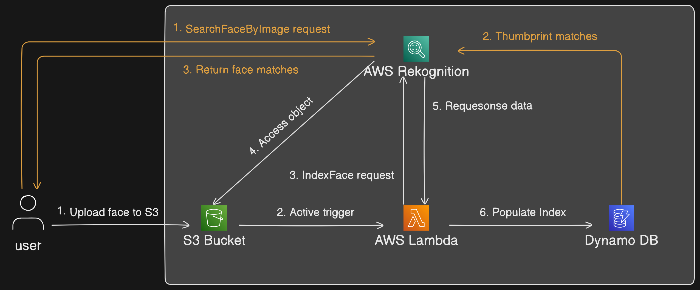

# face-recognition-aws-rekognition


Step-by-step Workflow:
1. User Uploads Face Image to S3: The process begins with a user uploading an image (typically a face) to an S3 bucket. The image is uploaded to a designated folder (e.g., index/).
2. S3 Event Trigger: Once the image is uploaded to S3, an S3 event trigger is activated. This trigger is configured to detect any object creation event in the bucket.
This triggers an AWS Lambda function which will process the image further.
3. Lambda Sends IndexFaces Request to Rekognition: The Lambda function invokes AWS Rekognition via the IndexFaces API request.
Rekognition takes the uploaded image from S3 and extracts the face data. The extracted face data is then indexed in Rekognition’s database for future reference.
4. Access Object from S3: AWS Rekognition accesses the object stored in S3 to perform facial analysis.
It processes the image to detect facial features and extract unique facial data (represented as vectors).
5. Return Face Matches from Rekognition: AWS Rekognition processes the face and can return any matching results if the face already exists in the Rekognition collection.
It returns the result to the Lambda function, which can decide further actions.
6. Store Data in DynamoDB: The Lambda function then populates DynamoDB with the results received from Rekognition.
DynamoDB stores metadata about the face, including the face ID, image location, and other relevant attributes.


# Installation guide
First, you can clone the repository by running the following command:
```bash
git clone https://github.com/ellyx13/face-recognition-aws-rekognition.git
```
Then, navigate to the project directory:
```bash
cd face-recognition-aws-rekognition
```
# AWS Setup
Before starting, open the config.py file and replace the values ​​you want. These values ​​will be used throughout the setup process to avoid confusion.
## Step 1: Install AWS CLI
If you haven't installed AWS CLI yet, you can install it in [here.](https://docs.aws.amazon.com/cli/latest/userguide/getting-started-install.html)
## Step 2: Configure AWS CLI
Once AWS CLI is installed, you'll need to configure it using your AWS Access Key ID and Secret Access Key. These credentials can be found in your AWS account's IAM section.

Run the following command to configure the AWS CLI:

```bash
aws configure
```

You'll be prompted for four pieces of information:

```bash
AWS Access Key ID [None]: <YOUR-ACCESS-API-KEY>
AWS Secret Access Key [None]: <YOUR-SECRET-ACCESS-KEY>
Default region name [None]: us-east-1
Default output format [None]: json
```
- AWS Access Key ID and Secret Access Key: These are the credentials you get from your IAM user.
- Default region name: Choose the region where you'll use Rekognition services (e.g., us-east-1).
- Default output format: Choose json for easy parsing of AWS CLI command outputs.

## Step 3: Verify AWS CLI Setup
To ensure that your AWS CLI is configured correctly, run the following command to check your identity:
```bash
aws sts get-caller-identity
```
If everything is set up correctly, you should see output similar to this:
```json
{
    "UserId": "AIDXXXXXXXXXXXXXX",
    "Account": "123456789012",
    "Arn": "arn:aws:iam::123456789012:user/<YOUR-USERNAME>"
}
```

## Step 4: Create a Rekognition Collection
Amazon Rekognition requires a **Collection** to store facial feature vectors. You can create a collection to hold the face data using the following AWS CLI command:
```bash
aws rekognition create-collection --collection-id <REKOGNITION_COLLECTION_NAME>
```
You should see output similar to this if the collection is created successfully:
```json
{
    "StatusCode": 200,
    "CollectionArn": "arn:aws:rekognition:us-east-1:123456789012:collection/<REKOGNITION_COLLECTION_NAME>",
    "FaceModelVersion": "7.0"
}
```

## Step 5: Create an S3 Bucket to Store Images
You need to store your images in an S3 bucket so that Amazon Rekognition can access them for analysis.
Run this command to create a new S3 bucket:
```bash
aws s3api create-bucket --bucket <S3_BUCKET_NAME>
```
You should see output confirming that your bucket has been created:
```json
{
    "Location": "/<S3_BUCKET_NAME>"
}
```

## Step 6: Create a DynamoDB Table for Metadata
DynamoDB store additional metadata related to the face recognition process (such as user IDs, timestamps, etc.).
Run this command to create a DynamoDB table:
```bash
aws dynamodb create-table --table-name <DYNAMODB_TABLE_NAME> --attribute-definitions AttributeName=RekognitionId,AttributeType=S --key-schema AttributeName=RekognitionId,KeyType=HASH --provisioned-throughput ReadCapacityUnits=1,WriteCapacityUnits=1
```
You should see the following output:
```json
{
    "TableDescription": {
        "AttributeDefinitions": [
            {
                "AttributeName": "RekognitionId",
                "AttributeType": "S"
            }
        ],
        "TableName": "<DYNAMODB_TABLE_NAME>",
        ...
        "TableArn": "arn:aws:dynamodb:us-east-1:xxxxxxxxxx:table/<DYNAMODB_TABLE_NAME>",
    }
}
```

## Step 7: Create IAM Role with Lambda as Trusted Entity
Run the following command to create the IAM role face_rekognition_role with this trust policy
```bash
aws iam create-role --role-name <IAM_ROLE_NAME> --assume-role-policy-document file://lambda-trust-policy.json
```
You should see output similar to this:
```json
{
    "Role": {
        "Path": "/",
        "RoleName": "<IAM_ROLE_NAME>",
        "RoleId": "AROXXXXXXXXXXXXXX",
        "Arn": "arn:aws:iam::xxxxxxxxxxx:role/<IAM_ROLE_NAME>",
    }
}
```

## Step 8: Attach Inline Policy to the Role
Replace your s3 bucket name and your arn dynamodb table (The value of the TableArn field in the DynamoDB creation step) in file rekognition-inline-policy.json, then run this command:   
```bash
aws iam put-role-policy --role-name <IAM_ROLE_NAME> --policy-name RekognitionInlinePolicy --policy-document file://rekognition-inline-policy.json
```

## Step 9: Create lambda function
Replace the values ​​of variables DYNAMODB_TABLE_NAME and REKOGNITION_COLLECTION_NAME in the lambda.py file. Then compress the lambda.py file into lambda.zip file
```bash
zip lambda.zip lambda.py
```
Next, create Lambda Function with the your role created in step 7
```bash
aws lambda create-function --function-name <LAMBDA_NAME> --runtime python3.11 --role <IAM_ROLE_ARN> --handler lambda.lambda_handler --zip-file fileb://lambda.zip
```
You should see output similar to this:
```json
{
    "FunctionName": "<LAMBDA_NAME>",
    "FunctionArn": "arn:aws:lambda:us-east-1:123456789012:function:<LAMBDA_NAME>",
    ...
}
```

## Step 10: Create an S3 Event Notification Configuration
You need to create a permission that allows S3 to invoke the Lambda function. Use the following command:
```bash
aws lambda add-permission --function-name <LAMBDA_NAME> --principal s3.amazonaws.com --statement-id s3invoke --action "lambda:InvokeFunction" --source-arn <S3_BUCKET_ARN> --source-account <YOUR_ACCOUNT_ID>

```
Now, replace Lambda ARN in file s3_notification_configuration.json and configure the S3 bucket sportsperson-images to trigger the Lambda function whenever an object is created in the index/ prefix.
```bash
aws s3api put-bucket-notification-configuration --bucket <S3_BUCKET_NAME> --notification-configuration file://s3_notification_configuration.json
```

So, you have successfully set up the Lambda function to index faces in the Rekognition collection whenever a new image is uploaded to the S3 bucket. Next, you'll set up the face recognition application using the AWS Rekognition API.

# Face Recognition Application Setup
## Step 1: Install required libraries
Install the required libraries by running the following command:
```bash
pip install -r requirements.txt
```

## Step 2: Run the application
Run the application by executing the following command:
```bash
python face_recognizer.py
```


Done! You have successfully set up the face recognition system using AWS Rekognition.

# How to use
This is a simple face recognition application that uses the AWS Rekognition API to recognize faces in images. The application has two main functionalities.


1. Add face: You can add a new face to the Rekognition collection by take a picture via webcam and enter the person's name. The application will extract the face features and store them in the s3 collection.


2. Check face: You can check if a person's face is in the Rekognition collection by take a picture via webcam. The application will compare the uploaded image with the faces in the s3 collection and display the result.


# Acknowledgments
I would like to express my gratitude to Vijayaraghavan Vashudevan for his excellent article, [Build your own Face Recognition Service using Amazon Rekognition](https://medium.com/cloudnloud/build-your-own-face-recognition-service-using-amazon-rekognition-c75919d7f66e). This blog post was an invaluable resource for the development of this project, providing clear and actionable insights into setting up an AWS Rekognition-based face recognition system. Thank you for sharing such a detailed and helpful guide.